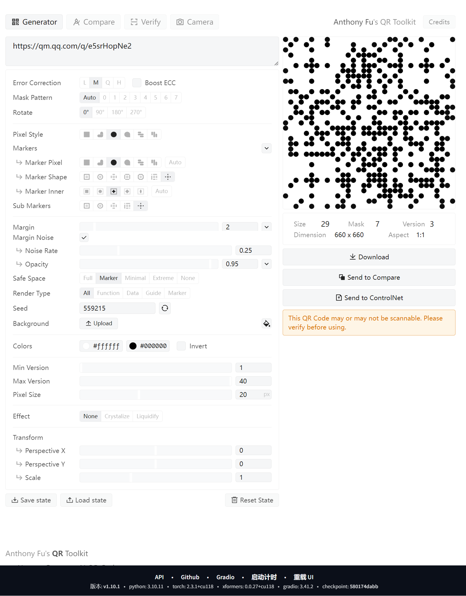
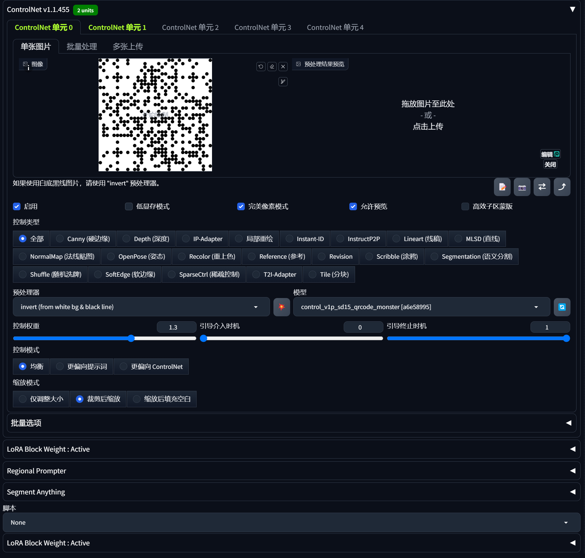

# AI 生成二维码教程

## 1. 插件下载

- **下载插件：**
  - **sd-webui-qrcode-toolkit**：用于生成二维码。
  - **adetailer**：增强图像细节。

> 这两个插件将帮助你生成二维码并进行后续的图像优化。

## 2. 识别二维码内容

- **二维码内容识别链接**：[在线二维码解码工具](https://tuzim.net/decode/)

> 通过该工具，你可以上传二维码图像并快速提取其中的内容，便于后续操作。

## 3. 使用 `qrcode-toolkit` 生成二维码



> 这是通过 `qrcode-toolkit` 生成的二维码示例。你可以根据自己的需求自定义二维码内容，并生成相应的图像。

## 4. 模型下载

- **模型下载链接**：[Civitai 模型下载](https://civitai.com/models/70921/duchaitenniji)


> 下载模型后，按照说明进行安装，以便用于后续的图像生成。

## 5. ControlNet 配置

### 5.1 配置 ADetailer 插件

- 在 **ControlNet** 中，勾选 **ADetailer** 插件来增强图像细节。

- **视频教程**：你可以参考这个博主的视频来下载 `qrcode_monster` 和 `brightness` 模型：[视频教程](https://www.bilibili.com/video/BV13h4y1L7yp/?spm_id_from=333.337.search-card.all.click)

#### ControlNet 0 单元配置（使用 `control_v1p_sd15_qrcode_monster` 模型）



- **控制权重**：1.2 ~ 1.5 逐步减小优化
- **引入时机**：0
- **退出时机**：1

#### ControlNet 1 单元配置


- **控制权重**：0.15 ~ 0.3 逐步减小优化
- **引入时机**：0.2 ~ 0.65
- **退出时机**：0.6 ~ 1
- **干预时间**：设置中段或后段约 40% 的干预时间

> 通过这些配置，ControlNet 将帮助你对生成的图像进行细节强化，进一步提升图像的质量和精细度。

## 6. 提示词和模型配置

### 正向提示词：

```
(best quality, masterpiece:1.3), 1 girl, adult woman, teal eyes, gray prom hairstyle, portrait, looking at viewer, solo, upper body, detailed background, witch hat, witch, magical atmosphere, hair flowing in the wind, purple trimmed dark colored clothes, whirlwind of glowing magic flames in the air, dark magic, (style-swirlmagic:0.8), floating particles, ruined castle background, backlighting, dim light, <lora:RootsBranchesAlv5:0.4>, RootsBranchesAl, <lora:add_detail:1>
```

### 反向提示词：

```
bad-hands-5, (worst quality:2), (low quality:2), (normal quality:2), lowres, bad anatomy, bad hands, normal quality, ((monochrome)), ((grayscale)), bad proportions, render, 3d, 2d, sketch, painting, digital art, drawing, (deformed, distorted, disfigured:1.3), poorly drawn, wrong anatomy, extra limb, missing limb, floating limbs, (mutated hands and fingers:1.4), disconnected limbs, mutation, mutated, ugly, disgusting, blurry, amputation, bad art, low details, incomplete, undetailed, fused body parts, poorly drawn face, out of focus, blurred, smudgy, glossy, glitchy, asian, bad human anatomy, more than two legs
```

> 这些提示词将帮助你精确控制生成图像的质量。正向提示词有助于提升图像的优质效果，反向提示词则帮助避免低质量或不良细节。

## 7. 生成结果


> 这是经过配置和调整后的图像生成结果。你可以根据需求继续微调参数，进一步提高图像质量。

## 8. 结果图展示


> 经过优化后的最终图像。通过不断的调整和优化，你可以获得符合预期的图像效果。

---

### 小贴士

- **提示词的重要性**：提示词在图像生成过程中至关重要。合理设置正向和反向提示词的组合，可以有效提高生成图像的质量与细节表现。
- **模型优化**：下载的模型通常可以根据你的需求进行微调。确保它符合你的具体应用场景。
- **插件选择**：安装插件时，确保插件版本与当前环境兼容，以避免可能的兼容性问题。

---

这个版本通过调整了顺序，使得流程更加清晰，也优化了整体的阅读体验。如果有任何其他需求，欢迎随时告诉我！